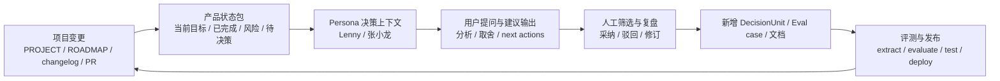

# LingSi 飞轮

*最后更新: 2026-03-18 | 版本: v0.5.22*

## 目标

让所有支持 LingSi 的 persona 不只是“会回答”，而是持续理解当前产品状态、最近变更、已有评测结果和待决策问题，并把这些理解再反哺到下一轮数据、评测和设计决策里。

前台用户文案统一叫 `决策`。
`LingSi` 保留为内部数据层和系统能力名。

## 飞轮结构

## 当前真相源

1. `docs/PROJECT.md`
2. `docs/ROADMAP.md`
3. `docs/changelog.md`
4. `docs/lingsi-eval-m4.md`
5. `docs/lingsi-eval-zhang.md`
6. `docs/code-review-report-*.md`
7. `anima-base/people/product/lenny-rachitsky/*`
8. `anima-base/people/product/zhang-xiaolong/*`

## 近端落地方案

### 1. 产品状态包

当前落地载体：`seeds/lingsi/decision-product-state.json`。

当前同步命令：
- `npm run lingsi:state-pack`：刷新状态包里的版本、完成项、评测结果和知识覆盖快照
- `npm run lingsi:refresh`：刷新状态包后继续刷新 LingSi seeds
- 当前 `anima-base` 已同步到 `083974d`；最新 upstream 增量为王慧文材料，本轮确认无新的 Lenny / 张小龙来源需要并入

需要一份面向 persona 的轻量状态包，字段固定，不直接把整份文档原样塞进 prompt：

- 当前版本
- 最近 3 个已完成改动
- 当前 3 个核心问题
- 已验证有效的设计方向
- 已知失败点 / 回归点
- 当前评测结果
- 下一步待判断事项

同步要求：每次影响决策 persona 的发版，必须先更新相关文档，再运行 `npm run lingsi:state-pack`，并在 changelog / PROJECT / ROADMAP 中留下对应记录。

### 2. Persona 消费方式

- `Lenny` 负责产品、增长、评测、优先级、节奏
- `张小龙` 负责交互自然性、入口设计、关系链、运营克制、产品边界
- 对产品/设计类问题，优先注入状态包，再叠加对应 persona 的 `DecisionUnit`
- 对泛问答问题，不强行注入产品状态包，避免上下文污染

### 3. 反哺机制

当 persona 输出对当前产品有价值的建议时，不直接当真理写回系统，而是进入三步：

1. 人工筛选：是否真有价值
2. 归类沉淀：写入文档 / 新增 eval case / 新增 candidate unit
3. 评测验证：确认它让回答或决策更稳，而不是只更像

## 本轮优先级

### P0

- 修崩溃和错误交互：轨迹查看卡死、主页名字被 badge 挤压
- 统一用户文案：前台从 `灵思` 收敛到 `决策`

### P1

- 主页 `@persona` 只保留决策版入口，减少分叉和误选
- 同步 `anima-base` 最新 Lenny / 张小龙来源，持续扩充 unit
- 建立 persona-aware eval 基线

### P2

- 引入结构化“产品状态包”
- 让 persona 在产品/设计问题上持续读取当前项目上下文
- 把人工采纳的建议反哺成新的 `DecisionUnit` 和评测题

## 不做的事

- 不把整份项目文档直接原样注入模型
- 不把 persona 输出直接当事实写回系统
- 不靠 mock 数据补齐空缺
- 不因为“更像某个人”就跳过评测
