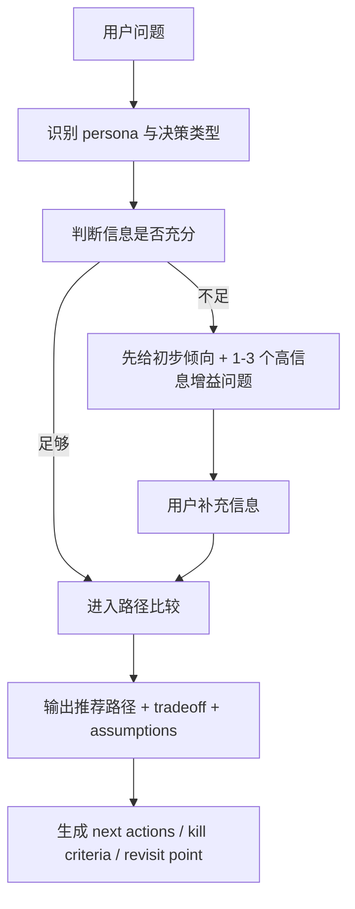

# LingSi V2 决策系统

*最后更新: 2026-03-18 | 状态: 设计收缩，先做最小闭环与真实用户验证*

## 为什么进入 V2

当前 LingSi 已经证明了一件事：**证据增强的 persona 决策回答**，确实能明显优于普通问答。  
但它还不是完整决策系统，主要缺口有三类：

1. `persona` 更像“风格 + 案例”，还不够像“稳定的判断系统”
2. 信息不足时虽然会追问，但还没有显式的“先判断还是先提问”的协议
3. 回答之后缺少“采纳 -> 回访 -> 结果 -> 反哺”的闭环

V2 的目标，不是继续堆 persona 数量，而是把 LingSi 升级成：

**有证据、有判断协议、有结构化决策对象、还能复盘学习的决策系统。**

---

## 当前收缩判断

在本轮真实 LingSi 自评里，`Lenny` 和 `张小龙` 给出了非常一致的结论：

- 当前最大风险不是 persona 不够多，而是**还没有真实用户**
- 当前最大陷阱不是系统不够复杂，而是**用系统建设替代用户验证**
- 因此 V2 不能按“完整蓝图”平推，必须先收缩成一个**最小可验证闭环**

这意味着：

- 暂停第三 persona
- 暂停更深的 UI 扩张
- 暂停过度扩 product state pack
- 先把 `DecisionRecord -> 采纳 -> 回访 -> 结果记录` 这条链路做通

## V2 目标

### 产品目标

让用户在重要问题上得到的不只是“一个更聪明的回答”，而是：

- 明确判断
- 明确为什么
- 明确缺什么信息
- 明确下一步怎么验证
- 明确之后如何回看结果

### 系统目标

V2 要形成四层能力：

1. `Persona Profile Layer`
2. `Decision Protocol Layer`
3. `Decision Object Layer`
4. `Closed-loop Learning Layer`

---

## 一、Persona Profile Layer

### 核心原则

这里的心理学框架不是给用户做人格诊断，而是为了**拆解 persona 的决策偏好**。

因此采用混合方案，而不是单押一个体系：

1. `Big Five`
2. `Jungian Archetypes`
3. `Decision Style Dimensions`
4. `Bias Risk Map`

### 为什么不用“荣格五维”做唯一底层

要澄清一点：

- `荣格` 是类型/原型系统的来源之一
- `Big Five` 是现代人格心理学里更稳定、可比较的 trait 框架

所以 V2 建议：

- 用 `Big Five` 做稳定人格底盘
- 用 `Jungian Archetypes` 做叙事化 persona 标签
- 用 `Decision Style Dimensions` 做真正影响产品输出的判断维度

### V2 Persona 画像结构

每个 persona 都应至少具备：

- `bigFive`
- `jungianArchetypes`
- `decisionStyle`
- `biasRisks`
- `questionProtocol`

这些字段已进入类型基线，见：
- `/Users/zhiyangyu/Desktop/试验项目集合/自进化产品/evocanvas/src/shared/types.ts`

### Lenny 的建模方向

建议把 Lenny 先拆成：

- `high openness`
- `high conscientiousness`
- `moderate extraversion`
- `high evidenceDemand`
- `high experimentation`
- `moderate ambiguityTolerance`
- `medium-high systemsThinking`

常见偏差风险：

- 过度偏爱“可验证实验”，低估长期叙事价值
- 对早期增长非常警惕，容易把“假增长”当首要风险
- 倾向把问题放进 stage / PMF / retention 框架里

### 张小龙的建模方向

建议把张小龙先拆成：

- `high openness`
- `high restraint`
- `high systemsThinking`
- `high ambiguityTolerance`
- `low speedBias`
- `high intuitionReliance`
- `high peopleOrientation`

常见偏差风险：

- 过度强调自然性，可能低估运营与商业效率工具的必要性
- 对“机制感”有天然警惕，容易对 KPI 驱动方案更苛刻

---

## 二、Decision Protocol Layer

V2 不再只靠“命中 unit 后让模型自由发挥”，而是要求每个 persona 遵循稳定的决策协议。

### 决策协议要回答的 5 个问题

1. 这是哪类决策
2. 当前信息是否足够
3. 应该先给倾向还是先追问
4. 应该用什么框架来拆
5. 回答结尾应该留下什么验证动作

### V2 的标准决策流程

### Lenny 协议

Lenny 默认策略应是：

- 先判断问题属于哪个阶段
- 如果能给方向，先给倾向
- 明确说出还缺哪些信息
- 框架优先级：`PMF -> retention -> distribution -> monetization`
- 结尾总要落到 `验证动作`

适合优先追问的情形：

- 阶段不明
- 指标不明
- 风险边界不明
- 用户说的是“感觉”，不是事实

### 张小龙协议

张小龙默认策略应是：

- 先判断用户真实意图与使用场景
- 如果目标不清，先追问场景
- 框架优先级：`自然性 -> 场景匹配 -> 关系压力 -> 运营克制`
- 结尾总要落到 `是否破坏自然体验` 的验证

---

## 三、Decision Object Layer

V2 的回答只是展示层；系统底层应先形成一个结构化 `DecisionRecord`。

这个类型已进入基线，见：
- `/Users/zhiyangyu/Desktop/试验项目集合/自进化产品/evocanvas/src/shared/types.ts`

### 为什么要结构化

如果没有结构化决策对象，就很难做：

- 决策回放
- 建议采纳
- 结果回访
- 自动生成新评测题
- 反哺新的 `DecisionUnit`

### V2 的最小决策对象字段

- `decisionType`
- `stage`
- `knowns`
- `unknowns`
- `options`
- `recommendedOptionId`
- `keyTradeoffs`
- `assumptions`
- `followUpQuestions`
- `nextActions`
- `killCriteria`
- `evidenceRefs`
- `outcome`

---

## 四、Closed-loop Learning Layer

这部分决定 LingSi 是不是完整决策系统。

### 闭环目标

把一次“回答”推进成：

1. 建议
2. 采纳
3. 执行
4. 回访
5. 结果归档
6. 反哺数据层

### V2 最小闭环

第一阶段只做 4 个动作：

1. `采纳这条建议`
2. `设回访时间`
3. `记录结果`
4. `生成 candidate unit / eval case`

### 结果反哺规则

只有符合下面条件的结果，才进入新的结构化资产：

- 建议被采纳
- 有明确结果
- 能说清“为什么有效 / 无效”
- 能提炼成可复用模式

---

## 落地优先级

### P0 - 最小闭环

先把 LingSi 从“更聪明的 persona 回答”推进成“可被采纳、可被回访的决策对象”。

交付：

- `DecisionRecord` 持久化
- 回答前形成 `DecisionRecord draft`
- 回答后写入 `answered`
- 为后续 `采纳 / 回访` 预留稳定字段

### P1 - 决策协议层

先把 persona 变成“有判断协议的人”，而不是“会模仿说话的人”。

交付：

- `lenny-decision-protocol.json`
- `zhang-decision-protocol.json`
- `question sufficiency` 判断函数
- `decision type` 分类函数

### P2 - Persona 心理学画像层

先只做 `Lenny / 张小龙`。

交付：

- `DecisionPersona.profile` 真正填充
- `Big Five + Jungian + Decision Style + Bias Risk`
- profile 字段进入 prompt / extraContext 链路

### P3 - 闭环系统

交付：

- 采纳按钮
- 回访时间
- 结果记录
- 反哺 candidate unit / eval case

---

## 30 天落地顺序

### 第 1 阶段：最小可记录闭环

- `DecisionRecord` draft 持久化
- `decisionTrace` 与 `DecisionRecord` 同步保存
- 建立真实用户验证台账

### 第 2 阶段：采纳与回访

- 给关键建议增加“采纳这条建议”
- 支持设置回访时间
- 记录结果：`working / mixed / not_working`

### 第 3 阶段：结果反哺

- 只把“被采纳且有结果”的建议升格成 candidate
- 再进入新的 `DecisionUnit / eval case`

## 成功标准

V2 不是看“更像谁”，而是看 4 个指标：

1. 用户是否更愿意采纳建议
2. 用户是否能说清“为什么这样建议”
3. 用户是否真的执行了建议
4. 系统是否能把执行结果反哺成更好的后续判断

如果这 4 件事成立，LingSi 才能从“会回答”变成“完整决策系统”。
